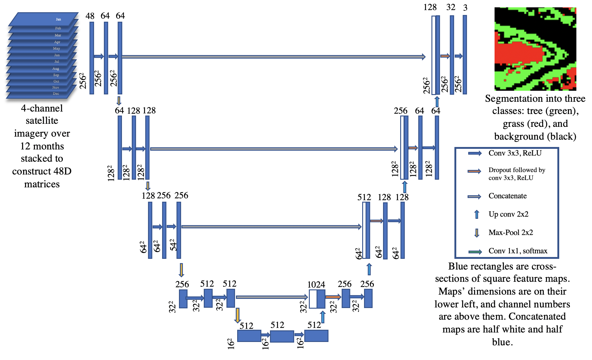
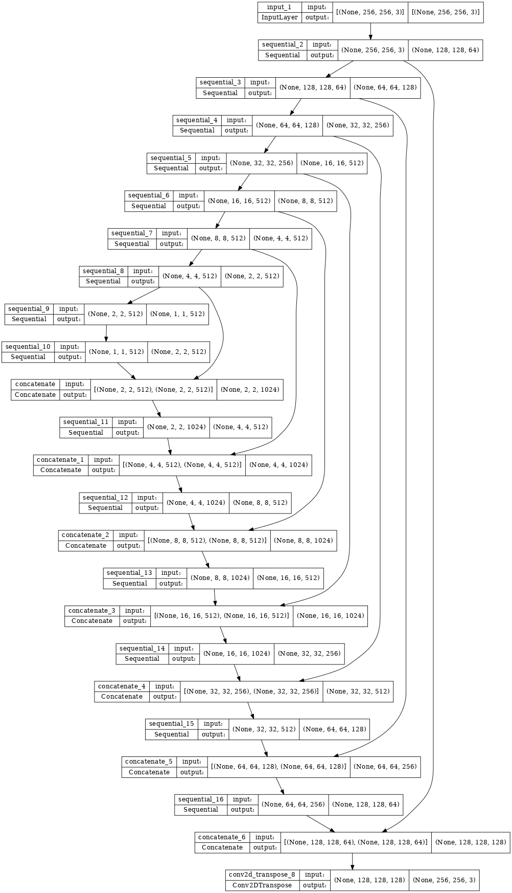

# Urban Tree Generator: Spatio-Temporal and Generative Deep Learning for Urban Tree Localization and Modeling 

This repository contains our dataset contribution and codebase to reproduce our paper titled **Urban Tree Generator: Spatio-Temporal and Generative Deep Learning for Urban Tree Localization and Modeling** in CGI 2022. Besides the codebase to reproduce our results, we hope that the dataset and codebase will help other researchers extend our methods in other domains also. 

# Annotated Dataset

As per our dataset contribution in our paper noted in Sec. 3.1, the annotated dataset of four cities (Chicago, Indianapolis, Austin, and Lagos) into three classes - tree, grass, others can be downloaded from **[redacted for anonymity]**.


A sample of the annotation of Indianapolis is shown below (green = tree, red = grass):

")

# Codebase

## Requirements/Prerequisites for installation/training

All the required libraries are enlisted in ```requirements.txt```. To directly install using ```pip```, please just use:

```pip install -r requirements.txt```

## Segmentation and clustering

The repository is arranged so that can be easily reproducible into directories. The directory **Segmentation_and_clustering** contains all the code necessary to train and infer the segmentation and clustering section as noted in the paper. Here are some points as pre-requisites:


* Download the preprocessed training data from **[redacted for anonymity]**
* Place the zip file inside the ```Segmentation_and_clustering``` directory and unzip
* A directory called ```Data``` will be created
* Simply run ```python train.py``` to train
* Inference and usage of pre-trained models are commented inside ```train.py```

## Localization

The directory ```Localization``` contains all the code necessary to train and infer the localization  section as noted in the paper (Sec. 4). Here are some points as pre-requisites:

* Download the preprocessed training data from **[redacted for anonymity]**
* Place the zip file inside the ```Localization``` directory and unzip
* Simply run ```python train_localization.py``` to train the cGAN model
* Inference and usage of pre-trained models are commented inside ```train_localization.py```

# Model Architectures

Below is our deep learning model for Segmentation of trees (Sec 3).



For the model of our localization network (Sec. 4) please see the implementatation inside ```train_localization.py``` which is inspired by the standard Tensorflow [cGAN network](https://www.tensorflow.org/tutorials/generative/pix2pix_files/output_dIbRPFzjmV85_0.png). The figure is reproduced below.



Ref. Tensorflow [cGAN network](https://www.tensorflow.org/tutorials/generative/pix2pix_files/output_dIbRPFzjmV85_0.png). 